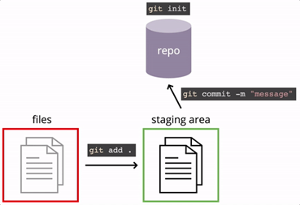
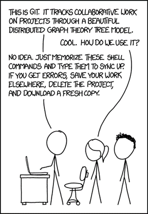

# Git and GitHub

## Version Control Basics

There are various Version Control Systems such as:

* [Git](https://git-scm.com/)
* [Subversion](https://subversion.apache.org/)
* [Mercurial](https://www.mercurial-scm.org/)

A version control system can be either:

* centralized - all users connect to a central, master repository
* distributed - each user has the entire repository on their computer

### Terminology

#### Version Control System / Source Code Manager

A version control system \(or source code manager\) is a tool that manages different versions of source code. It helps to create snapshots \("commits"\) of project files, thereby, supporting the tractability of a project.

#### Repository / repo

A repository is a directory which the version control system tracks and should contain all the files of your project. Besides your project files, a repository contains \(hidden\) files that git uses for configuration purposes. Git, by default, tracks all your files in a repository. If there are files you do not wish to track, you can include them in the manually created .gitignore file.

Repositories can be located either on a local computer or on the servers of an online version control platform \(such as Github\).

#### Staging Area / Staging Index / Index

Before committing changes to your project code, the files you want to snapshot need to be added to the Staging Index. Changes to these files can be captured in a commit.

#### Commit

A commit is a snapshot of the files that are added to the Staging Index. Creating a commit can help you to save a particular version of your project. When committing changes, you should also include a commit message that explains the changes of the project files since the previous commit. Therefore, commits track the evolution of your project and allows you to see the changes from one commit to another. It is also useful when experimenting with new code, as git makes it possible to jump back to a previous commit in case your code changes do not work out as planned.

#### SHA

A SHA\("Secure Hash Algorithm"\) is an identification number for each commit. It is a 40-character string composed of characters \(0–9 and a–f\) such as `e2adf8ae3e2e4ed40add75cc44cf9d0a869afeb6`.

#### Branch

A branch is a line of development that diverges from the main line of development. It further allows you to experiment with the code without modifying the line of development in the master branch. When the project development in a branch turns out successful, it can be merged back to the master branch.

#### Checkout

Checkout allows you to point your working directory to a different commit. Therefore, you can jump to a particular SHA or to a different branch.

#### .Git Directory Contents

The .git directory contains:

* config file - it stores the configuration settings
* description file - file used by the GitWeb program
* hooks directory -  client-side or server-side scripts can be placed here to hook into Git's lifecycle events
* info directory - contains the global excludes file
* objects directory - stores all the commits
* refs directory - holds pointers to commits \(e.g "branch" and "tag"\) 

### Install, setup git

* Supported browsers: current versions of Chrome, Firefox, Safari, Microsoft Edge    
* Create a [GitHub](https://github.com/) account              
* Install [git](https://git-scm.com/downloads)   
  * If you are on a Mac, git should already be installed.        
  * If you are using a Windows machine, this will also install a program called _Git Bash_, which provides a text-based interface for executing commands on your computer.
* Configure installation    
  * `git config --global user.name "your-full-name"`    
  * `git config --global user.email "your-email-address"`     
* SSH key: for faster usage \(no password will be needed afterwards\)    
  * Check if you already have: Is it anything in .ssh? `ls .ssh`    
    * if no, create a new one and [add to ssh agent](https://help.github.com/en/articles/generating-a-new-ssh-key-and-adding-it-to-the-ssh-agent)                             
    * if yes, go to next step        
  * [Add new SSH key](https://help.github.com/en/articles/adding-a-new-ssh-key-to-your-github-account) to your github account           
* Download [Sublime Merge](https://www.sublimemerge.com/download) \(recommended git client\) 

### Git workflow

#### Making changes

* `git status`, `git init` \(store all changes you commit in this folder\), `git add` \(except `.gitignore`\)
* `git commit` often, to avoid conflict
  * commit message should be: If applied, this commit will “your message” \(eg. `git commit -m "change label names"` or "update README"\).   
  * commit message could also refer to Issues \(eg. “close \#3”\) \(issues are like to-do-s\)
* `git log`: view the history of commits you’ve made

#### Collaborate with others

In practice, it is good to be sure that you have an updated version of the repository you are collaborating on, so **you should git pull before making your changes**. The basic collaborative workflow would be:

* update your local repo with `git pull origin master`,
* make your changes and stage them with `git add`,
* commit your changes with `git commit -m`, and
* upload the changes to GitHub with `git push origin master`

It is better to **make many commits with smaller changes** rather than of one commit with massive changes: small commits are easier to read and review.

* fork: copy to origin / clone: copy remote repo to create local repo / pull: copies changes from a remote repository to a local repository.  
* .gitignore \(eg. large files OR on Mac hidden .DS\_Store files OR data in ss-descriptives\)

#### Branching, conflicts

Note, if someone pushes a commit to GitHub before you push your changes, you’ll need to integrate those into your code \(and test them!\) before pushing up to GitHub.

* `git diff` displays differences between commits.
* `git checkout` recovers old versions of files / `git revert` backs out commit

  Branching

* `git branch` creates a new branch
* `git checkout` switches to a different branch

  Merging

* `git merge` merges other\_branch into the current branch

**Conflicts occur when two or more people change the same file\(s\) at the same time.** The version control system does not allow people to overwrite each other’s changes blindly, but highlights conflicts so that they can be resolved.

* **Push**: You will not be able to push to GitHub if merging your commits into GitHub’s repo would cause a merge conflict. Git will instead report an error, telling you that you need to pull changes first and make sure that your version is “up to date”. Up to date in this case means that you have downloaded and merged all the commits on your local machine, so there is no chance of divergent changes causing a merge conflict when you merge by pushing.
* **Pull**: Whenever you pull changes from GitHub, there may be a merge conflict! These are resolved in the exact same way as when merging local branches: that is, you need to edit the files to resolve the conflict, then add and commit the updated versions.

### Useful commands

| Code | Short description |
| :--- | :--- |
| `git init` | Initialize local git repository |
| `git status` | Check the status of git repository \(e.g. the branch, files to commit\) |
| `git add` | Add files to staging index |
| `git add .` | Add all modified files to staging index |
| `git commit -m"Text"` | Commit changes with commit message |
| `git log` | Check git commits specifying SHA, author, date and commit message |
| `git log --oneline` | Check git commits specifying short SHA and commit message |
| `git log --stat` | Check git commits with additional information on the files changed and insertions/deletions |
| `git log -p` | Shows detailed information on lines inserted/ deleted in commits |
| `git log -p --stat` | Combines information from previous two commands |
| `git log -p -w` | Shows detailed information on commits ignoring whitespace changes |
| `git show` | Show only last commit |
| `git show <options> <object>` | View expanded details on git objects |
| `git diff` | See the changes that haven’t been committed yet |
| `git diff <SHA> <SHA>` | Shows changes between commits |
| `git tag` | Show existing tags |
| `git tag -a "tagname"` | Tag current commit |
| `git tag -d "tagname` | Delete tag |
| `git tag -a "tagname" "SHA pattern"` | Tag commit with given SHA pattern |
| `git branch "name_of_branch" "SHA pattern(optional)"` | Create new branch – at SHA pattern |
| `git branch “name_of_branch” master` | Start new branch at the latest commit of master branch |
| `git checkout “name_of_branch”` | Move pointer to the latest commit of the specified branch |
| `git branch -d “name_of_branch` | Delete branch, use -D to force deletion |
| `git checkout -b “name_of_branch”` | Create branch and checkout in one command |
| `git log --oneline --graph --all` | Show branches in a tree |
| `git merge “name_of_branch_to_merge_in”` | Merge in current branch to another |

## Useful resources for mastering git and github:

* Technical foundations of informatics book: [https://info201.github.io/git-basics.html](https://info201.github.io/git-basics.html)
* Software carpentry course \(Strongly recommended\): [https://swcarpentry.github.io/git-novice/](https://swcarpentry.github.io/git-novice/)
* Github Learning Lab: [https://lab.github.com/](https://lab.github.com/)
* If you are really committed \(pun intended\): [https://git-scm.com/book/en/v2](https://git-scm.com/book/en/v2)
* Getting started with Github: [https://help.github.com/en/github/getting-started-with-github](https://help.github.com/en/github/getting-started-with-github)
* Git cheatsheet: [https://education.github.com/git-cheat-sheet-education.pdf](https://education.github.com/git-cheat-sheet-education.pdf)
* Learn git with bicbucket cloud: [https://www.atlassian.com/git/tutorials/learn-git-with-bitbucket-cloud](https://www.atlassian.com/git/tutorials/learn-git-with-bitbucket-cloud)

## Useful GUI tools for version control:

* Sublime Merge: [https://www.sublimemerge.com](https://www.sublimemerge.com)
* Version Control in VS Code: [https://code.visualstudio.com/docs/editor/versioncontrol](https://code.visualstudio.com/docs/editor/versioncontrol)

